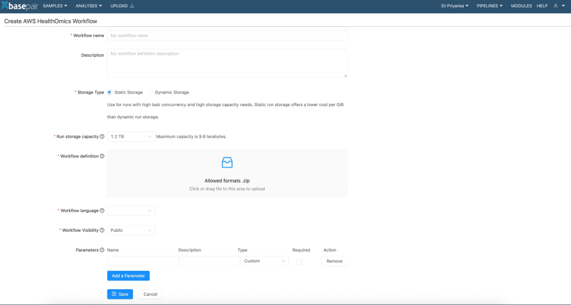

1.  **Platform Overview**    Basepair is a cloud-based bioinformatics platform designed to streamline genomic data analysis for clinical and research labs. It enables users to upload raw sequencing data, run customizable pipelines, and generate interactive reports — all from a user-friendly interface.

   **Key Benefits**

   * Accelerated genomic analysis workflows

     *  Simplified team collaboration and access control

     *  Seamless integration with cloud storage and analysis environments

     *  Intuitive data sharing and management

     *  Automated and reproducible pipelines

   

2. **Supported File Types**

     HealthOmics supports the following file types:

   **FASTQ**: [View Sample](https://aws.basepairtech.com/samples/101230)  
   **BAM**: [View Sample](https://aws.basepairtech.com/samples/101232)  
   **CRAM**: [View Sample](https://aws.basepairtech.com/samples/101231)  
     
   Basepair integrates with **AWS HealthOmics** to provide access to additional pipelines, scalable infrastructure, and seamless interoperability with genomic workflows.  
   

3.   **Uploading Samples to HealthOmics**

   The upload process mirrors Basepair’s standard flow, with a key consideration **Genome field**  
   For **FASTQ** files: Any genome can be selected.  
   For **BAM/CRAM**: The genome must match the file's reference genome.  
   HealthOmics allows a maximum of **5 concurrent sample imports**. Additional samples are queued.  
   * The GUI does not explicitly show whether a sample resides in HO or S3.

4.  **Identifying HealthOmics Samples is uploaded to HealthOmics or not:** 

   To verify if a sample was uploaded to HealthOmics:  
   **Status Indicator**:  
   During import: ho\_import\_in\_progress  
   Once complete: completed

**4.1.  Sample URI Format**:

**Basepair S3:**  
 s3://basepair/uploads/7819/101233/3d06.fasta

**HealthOmics S3:**  
 s3://613396392907-.../sequenceStore/.../readSet/.../Control1\_L001\_R1.fastq.gz

Note: Currently, the GUI does not explicitly show whether a sample resides in HO or S3

5.  **Running a HealthOmics Analysis**

    Select a **Ready-2-Run** or **Private Workflow** from HealthOmics.

    Choose the relevant sample.

    Provide any required parameters.

    Once configured, an analysis will be launched on both **Basepair** and **HealthOmics** platforms.

 
 **Example Analyses**

1.  **Ready-2-Run Workflow**: [View Analysis](https://aws.basepairtech.com/analyses/122095)

   2.  **Private HealthOmics Workflow**: [View Analysis](https://aws.basepairtech.com/analyses/122167)

   3.  **Basepair Workflow**: [View Analysis](https://aws.basepairtech.com/analyses/122164)

   4.  **Interactive Report Example**: [View Report](https://aws.basepairtech.com/analyses/122095)

   

6.  **Creating a Private HealthOmics Workflow**

    You can create your own custom workflows on AWS HealthOmics and manage them via the Basepair platform.

 **Steps to Create a Private Workflow**

 Navigate to **Pipelines** \> **Create New AWS HealthOmics Workflow**.

 Fill in the required fields:

 Workflow Name

 Description

 Run Storage Capacity

 Workflow Definition (ZIP format)

 Workflow Language

 (Optional) Main Workflow Definition File Path

 Workflow Visibility (Private/Public)

 Input Parameters

  **Important Notes**:

1. The workflow definition file must be a zip  
   2. If we select an incorrect workflow language then Workflow creation will fail  
   3. The visibility field states the visibility of workflow.   
   4. If private it will be visible to the Owner of workflow only.  
   5. If public it will be visible to all the users on the host.  
   6. Workflow creation will fail if we specify an incorrect Main workflow definition file path  
   7. The parameters state the parameters expected during the run time.  
   8. We can create max 100-private workflow  
   9. Workflow is created on HealthOmics only if it's created successfully.  
   10. Max file for zip is 4.4Mb

7.  **Creating a HealthOmics Reference Genome**

 You can create and import reference genomes into HealthOmics directly from Basepair.

 **Steps:**

Go to the **Samples** tab and select **Add Genome**.

Enter a unique genome name and upload your genome file.

Once uploaded to S3, **ho\_import** begins automatically.

Status will be marked as **Completed** once the genome is imported successfully.	

You can also add genome-level parameters during setup.

8.  **Importing AWS HealthOmics Workflows into Basepair:**

   1.   **Step 1: Discover Available Workflows**

Navigate to **Pipelines \> AWS HealthOmics Workflows**

All workflows from your AWS account will be listed

2.  **Step 2: Sync a Workflow**

Click the **Sync** button to import the workflow and its parameters

Sync status will show ✅ Yes once successful

3.  **Step 3: Configure Parameters**

Go to **Pipelines \> Basepair HealthOmics Workflows \> \[Your Synced Workflow\] \> Edit**

* For each parameter, define how it behaves:  
  * **Sample URI**: Auto-populated from uploaded sample  
    * **Fixed Value**: Hardcoded, hidden from users  
    * **Custom**: User-editable during analysis setup  
    * **Add/Edit Descriptions**:  
    * Descriptions are editable  
    * Tooltips support multiline text and special characters

 **8.4.  Step 4: Select Storage Type**

When creating or updating a workflow, select **Dynamic Storage Option** to enable flexible AWS HealthOmics storage support.

This option must remain enabled even after syncing.

9.   **Workflow Details & Reporting**

   1.   **Interactive Report**

       Example: [View Report](https://aws.basepairtech.com/analyses/122095)

       Rich, browser-based visual reports for workflow outputs

 **9.2.  Input/Output Files**

*  Example: [View I/O](https://aws.basepairtech.com/analyses/122095) (Click on Input/Output tab)

  *  Download or preview all files generated during the analysis

