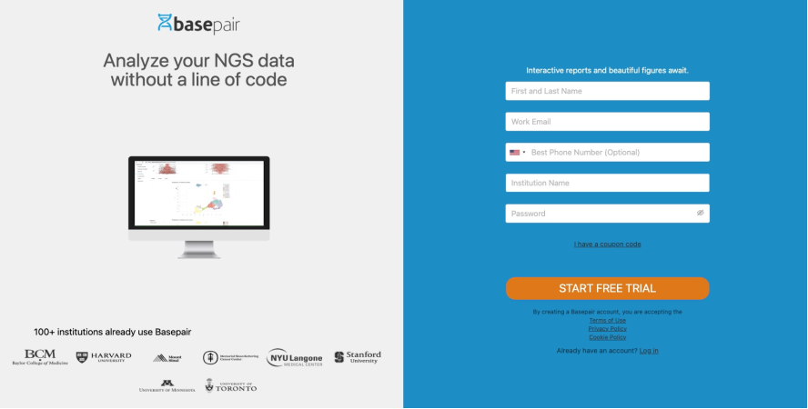
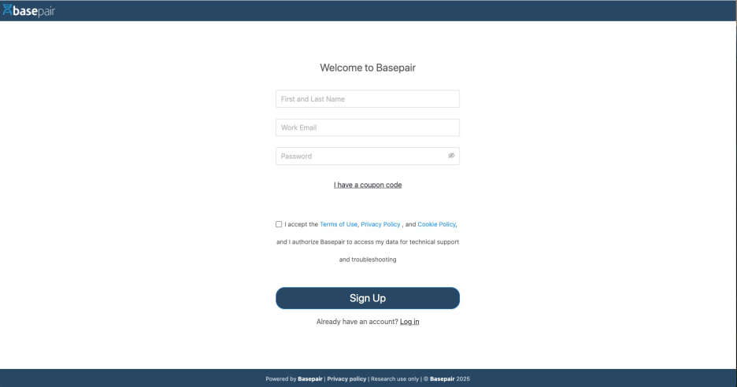
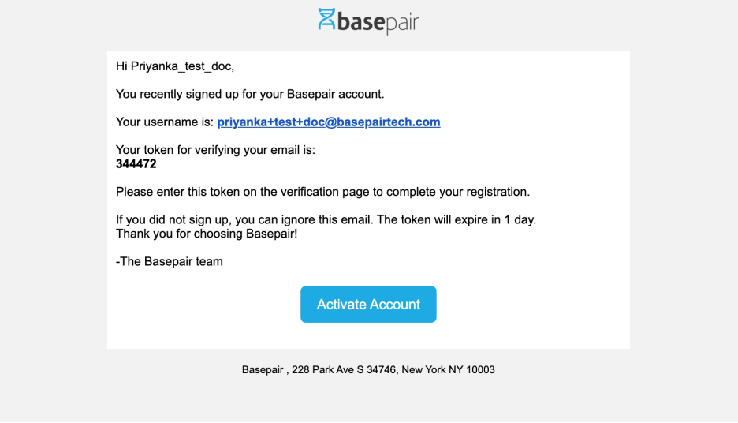
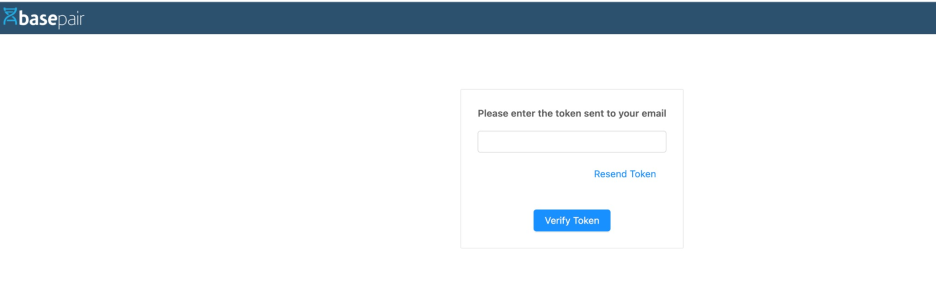
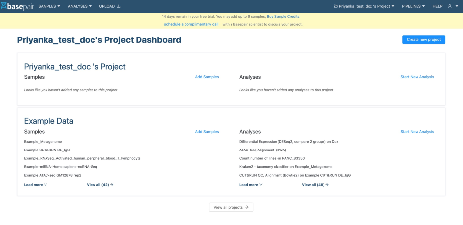

#### Customer User Registration

1. #### To create your Basepair account:

   #### **US region**: [https://app.basepairtech.com/signup](https://app.basepairtech.com/signup)

   #### **Tokyo region**: [https://ap-1.basepairtech.com/signup](https://ap-1.basepairtech.com/signup)

   #### **User domain**: [https://\[Domian\_name\].basepairtech.com/signup](https://ap-1.basepairtech.com/signup) 

    
    
2. **Fill in the required fields:**  
   * **Name** (mandatory)  
   * **Organization name**  
   * **Work email address** (mandatory)  
   * **Phone number**  
   * If you have a coupon, click **“I have a coupon code”** and enter it before submitting.

   *Note*: Personal email domains (e.g., @gmail.com, @hotmail.com) are not accepted. Only organization-issued emails are allowed.

3. **Email Validation**  
   * After submitting the form:  
   * You’ll receive an email with an activation link.

    

   * Click **“Activate Account”** in the email.

    

   * On the redirected page, enter the verification code.  
   * Click **“Verify Token”** to activate your account.

    

   * ⏱ If the token expires, you can request a new one.  
   * Once activated, you’ll be redirected to the **Project Dashboard**, either with a free trial or coupon.

    

   

   

