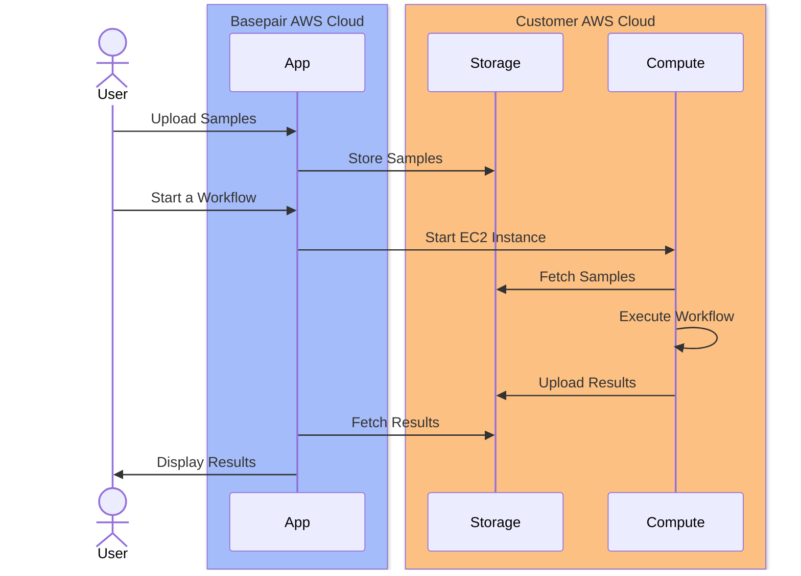

# AWS

- Connected Cloud is a solution that allows you to run NSG workflows on Basepair platform with your own AWS account.
- Customer will interact with Basepair platform to upload samples and start workflows.
- Basepair platform will then connect with customer's AWS account to fetch samples, run workflows and upload results.
- Customer will be able to view results on Basepair platform.

## How Connected Cloud works

## Deploying Connected Cloud

Steps to deploy Connected Cloud with your AWS account:

- Sign in to your AWS account.
- To deploy the Connected Cloud in your aws account, please reach out to basepair support team for the CloudFormation template.
- Once you have the cloudformation template, you will be asked to choose the following parameters:
  - `AWS Region`: Choose the region where you want to deploy the stack.
- Once the stack is deployed, go to the Outputs tab and note down the `Key` and `Value` of all the parameters into a `config.json` file.
- Send the `config.json` file to Basepair support team.
- Basepair support team will then configure the Connected Cloud with your Basepair account.

