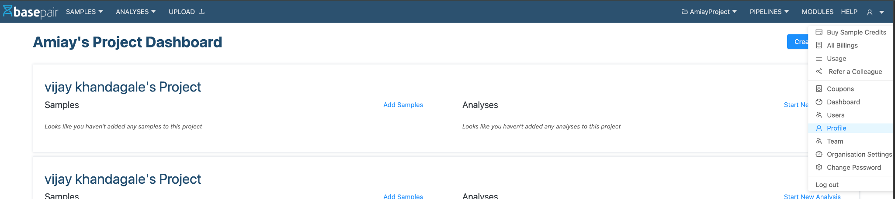
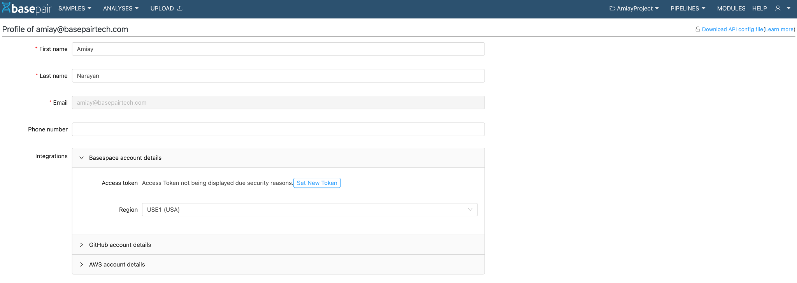
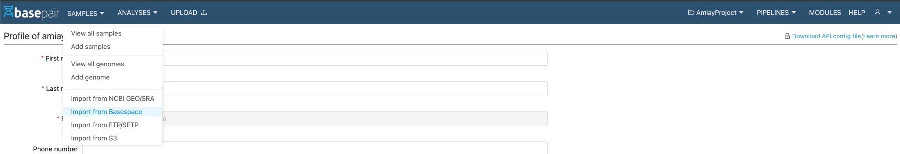
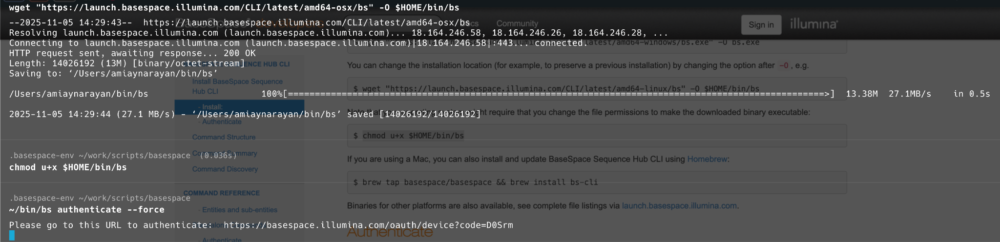
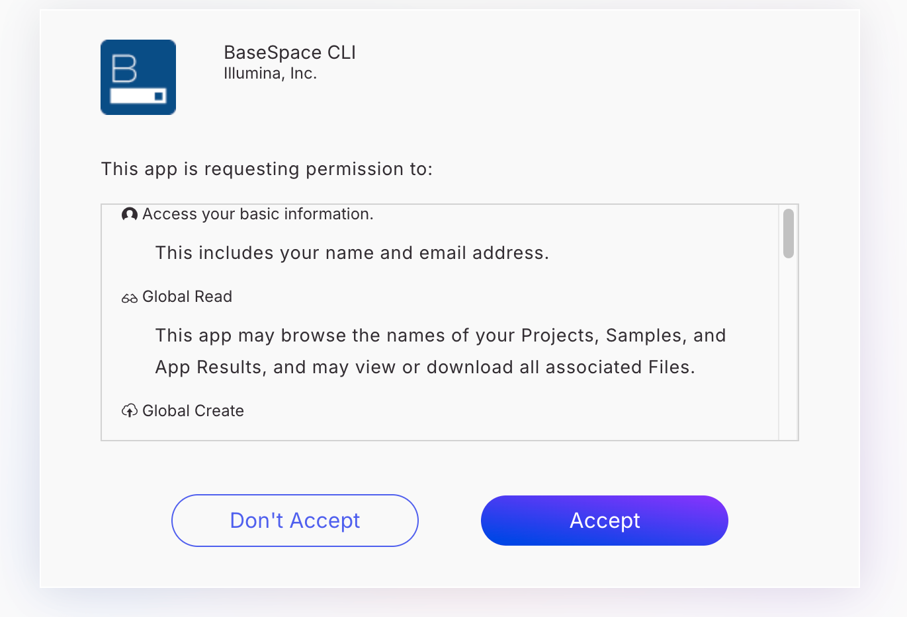
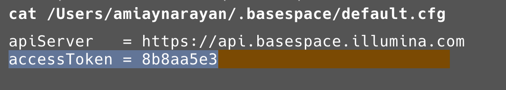

# Basespace Integration

This guide walks you through the process of linking your Basespace account with your Basepair account, allowing you to directly import sequencing data from Basespace into your Basepair workspace.

---

## Overview of the Process

1. Navigate to **User Menu → Profile**.  
   

2. Click on the expandable section: **Basespace Account Details**.


3. Paste the **access_token** that you have with you (explained below in **Getting the Access Token**).

4. Select the correct **Region** for your Basespace account.

5. From the left navigation menu, go to **Samples → Import from Basespace**.  
   

6. Once connected, follow the **Importing from Basespace User Guide** to begin importing your data.

---

## Getting Access Token (Step 3 in the flow)

While there could be a few ways to get the access token, this guide uses the cleanest approach—[**Basespace CLI**](https://developer.basespace.illumina.com/docs/content/documentation/cli/cli-overview#standalone-commands).

### Step 1: Install the Basespace CLI

Run the following commands based on your operating system.

**For Linux**
```bash
wget "https://launch.basespace.illumina.com/CLI/latest/amd64-linux/bs" -O $HOME/bin/bs
chmod u+x $HOME/bin/bs
```

**For macOS**
```bash
wget "https://launch.basespace.illumina.com/CLI/latest/amd64-osx/bs" -O $HOME/bin/bs
chmod u+x $HOME/bin/bs
echo 'export PATH="$HOME/bin:$PATH"' >> ~/.zshrc
source ~/.zshrc
```

**For Windows**
```bash
wget "https://launch.basespace.illumina.com/CLI/latest/amd64-windows/bs.exe" -O bs.exe
```

**Alternate consolidated commands (with prompts):**
```bash
# Linux
$ wget "<https://launch.basespace.illumina.com/CLI/latest/amd64-linux/bs>" -O $HOME/bin/bs

# MacOS
$ wget "<https://launch.basespace.illumina.com/CLI/latest/amd64-osx/bs>" -O $HOME/bin/bs
$ chmod u+x $HOME/bin/bs
$ echo 'export PATH="$HOME/bin:$PATH"' >> ~/.zshrc
$ source ~/.zshrc

# Windows
$ wget "<https://launch.basespace.illumina.com/CLI/latest/amd64-windows/bs.exe>" -O bs.exe
```


### Step 2: Authenticate Your Device

Run the following command to link your Basespace account:
```bash
bs authenticate
```

If you’ve used the CLI before, you might need to add the `--force` flag:
```bash
bs authenticate --force
```

You’ll receive a URL and a code in the terminal, similar to the example below:
```text
Please go to this URL to authenticate: https://basespace.illumina.com/oauth/device?code=6Cesj
```

Open the provided URL in your browser, log in to your Basespace account, and click **Accept** to authorize access.  


### Step 3: Get Your Access Token

After successful authentication, run the following command to view your credentials:
```bash
cat $HOME/.basespace/default.cfg
```

You’ll see an output similar to this—pay attention to `apiServer` and the `accessToken`:
```ini
apiServer = https://api.basespace.illumina.com/
accessToken = <your_access_token_here>
```

Copy the **accessToken** value and paste it into the **Access Token** field in Basepair (as shown in Step 3 of the main flow).  

