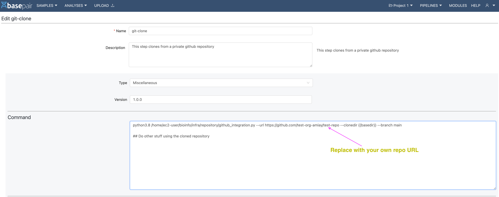
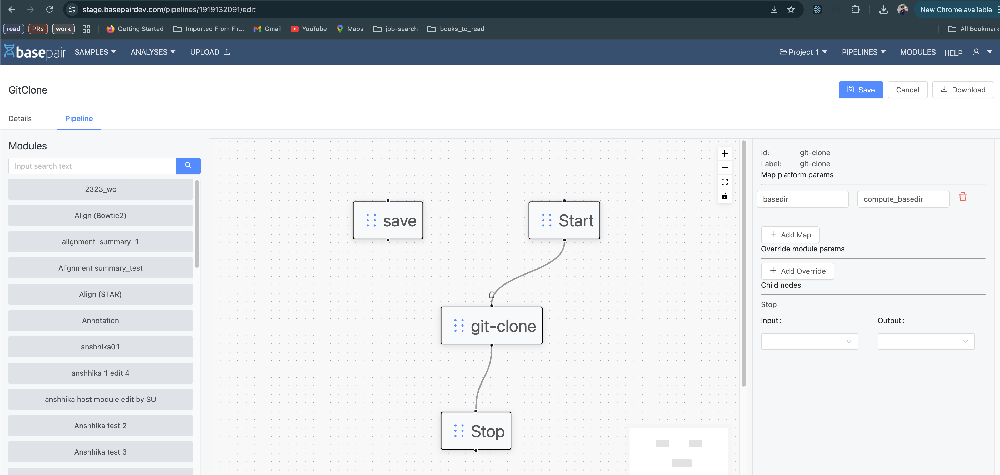

# GitHub Integrations

This guide explains how to integrate your GitHub account with Basepair to enable repository access for pipeline execution.
You can install the Basepair GitHub App either at the Organization level or the User level, depending on your setup.

- ## Organization-Level Installation
    Install Basepair Github app at your organization github account and provide read-only access to repositories which will be used during pipeline execution.

    - ### Step1: Open Integration Settings
        - Go to the Organizational setting Page > Integration tab, at this section.
        - Click on Install **Basepair App** button to install it.

        
    - ### Step 2: Authorize on GitHub
        - You will be redirected to the GitHub installation page. 
        - Click **Configure**.

        
    - ### Step 3: Select Organization and Repositories
        - Select your **organization** account  
        - Click on right arrow to continue.

        
        - Select the repositories option you want to grant access to Basepair. 
        - Click Install.

        
    - ### Step 4: Verify Installation
        After installation, you’ll be redirected to **GitHub Settings → Applications**, where the Basepair app should appear under installed apps.

        
        #### To modify access:
            **Add/Delete Repositories**: Select or deselect repositories, then click Save.

            
            **Verify Installation**: Go back to your Basepair **Organisation settings page (Integration tab)**, enter the repository URL, and click **Verify**.
            - If the repository shows as verified, integration is successful.

            
            - If not, recheck the app configuration.

            
    - ### Step 5: Uninstall
        - To remove the integration, go to GitHub Settings → Applications.\
        - Find Basepair, then click Uninstall.

        

- ## User-Level Installation
    If you prefer to connect your personal GitHub account, follow these steps:
    Install Basepair Github app **at your personal github account** and provide read-only access to repositories which will be used during pipeline execution.

    - ### Step 1: Open Profile Settings:
        - Select Profile from setting

        
        - Click on Github account details.
        - Click **Install Basepair App**.

        
    - ### Step 2: Authorize on GitHub
        - You will be redirected to the GitHub installation page.
        - Click **Configure**.

        
    - ### Step 3: Select Account and Repositories
        - Choose your **personal GitHub** account.
        - Click the right arrow to proceed.

        
        - Select the **repositories** you want Basepair to access to.
        - Click **Install**.

        
    - ### Step 4: Verify Installation
        After installation, you’ll be redirected to **GitHub Settings → Applications**, where the Basepair app will appear under installed apps.

        
        #### To modify access
            - **Add/Delete Repositories**: Select or deselect repositories, then click **Save**.

            
            - **Verify Installation**: Return to your Basepair **Profile Page**, enter the repository URL, and click **Verify**.
            - If verified, integration is complete.

            
            - If not, check the app configuration.

            
    - ### Step 5: Uninstall (Optional)
        To remove Basepair from your personal GitHub account, go to **GitHub Settings → Applications**, locate Basepair, and click **Uninstall**.
        If you want to remove it from your account then click on uninstall.

        

- ## Understanding the Difference: Organization-Level vs User-Level GitHub Integration
    | **Aspect** | **Organization-Level Integration** | **User-Level Integration** |
    |-------------|------------------------------------|-----------------------------|
    | **Scope of Access** | Grants access to repositories within a GitHub organization account. | Grants access only to repositories under a personal GitHub account. |
    | **Who Can Install** | Requires installation by an organization owner or admin. | Can be installed by any individual user. |
    | **Repository Access** | Shared among authorized members of the organization. | Accessible only by the user who performed the installation. |
    | **Recommended For** | Teams or projects managed within a company GitHub organization. | Individual users or personal projects. |
    | **Adding/Removing Repos** | Managed by the org admin; changes apply to all users. | Managed by the individual user only. |
    | **Permissions** | Requires organization-level approval for selected repositories. | Requires personal authorization for selected repositories. |


# Github Integration: Running an analysis:


### Step 1: Modify your custom module

Before you start using your private repository, you must clone it. Being a private repository, it cannot be cloned like a public repo (shown below):

```bash
# clone public repo
$ git clone <url-of-public-repo>
```

To clone private repo: 

```bash
$ python3.8 /home/ec2-user/bioinfo/infra/repository/github_integration.py --url https://github.com/test-org-amiay/test-repo --clonedir {{basedir}}/test-repo --branch main
```

`--url` : URL of the github Repository

`--clonedir` : location on the machine where you want to copy the repo; typically `{{basepair}}/<name_of_your_repo>`

`--branch` : Branch that you want to clone


This step can be done on the create page (or edit) of the module, as shown below in the image.



To go to the create a new module, visit https://\<basepair-url\>/modules/new

To edit an already existing module: visit https:///\<basepair-url\>/modules/ and the search for your module using the search feature as shown below
 


### Step 2: Add `basedir` mapping

The module that you created would be a part of a pipeline. Navigate to the edit section of the pipeline.




In the `Map platform params` section (right side of the above image), add the mapping as shown

`basedir` : `compute_basedir` 

### Step 3: Run an Analysis using the new Pipeline


