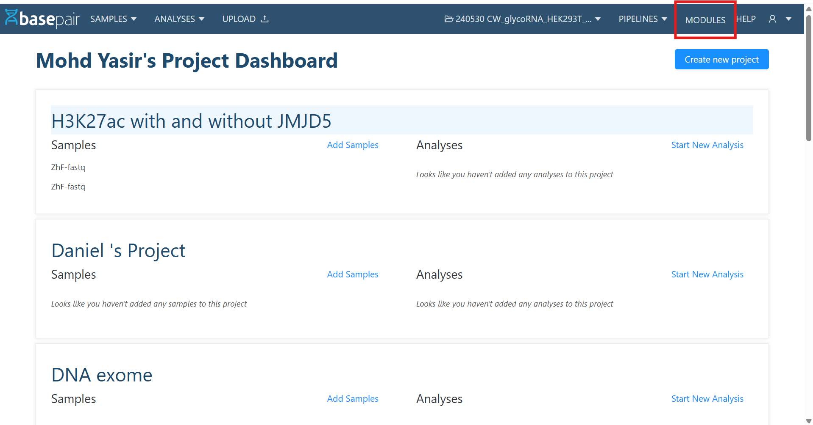
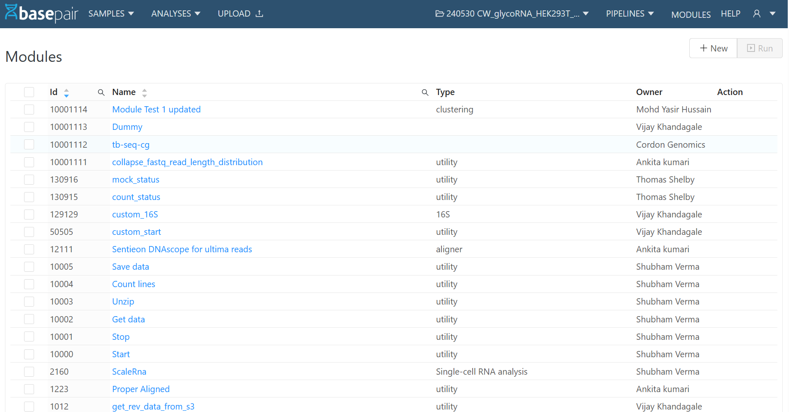
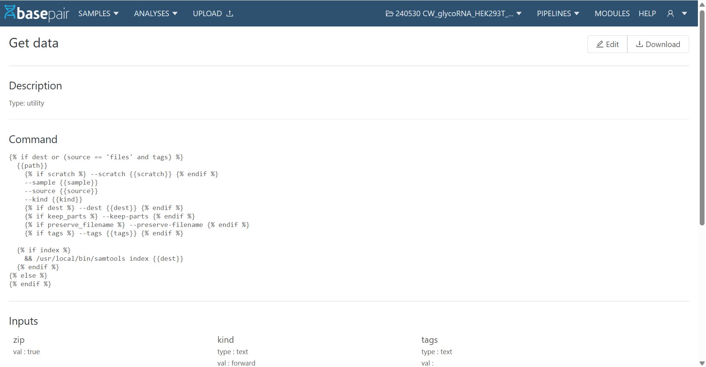
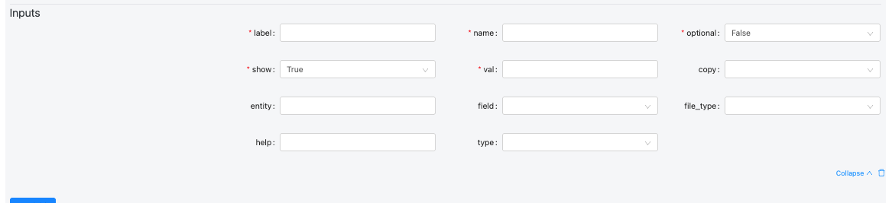
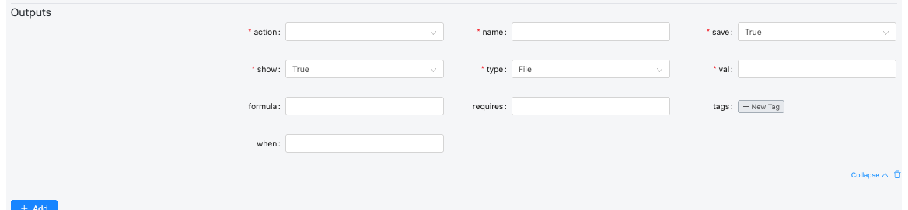
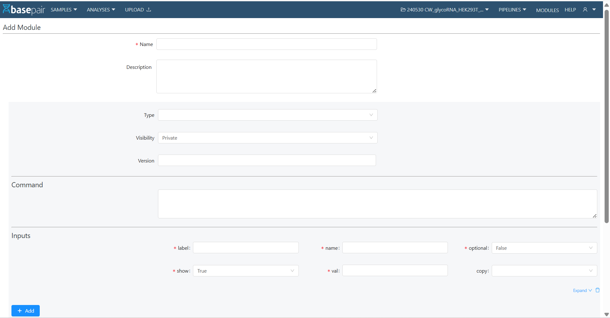
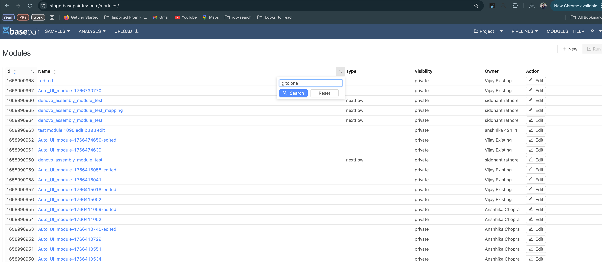
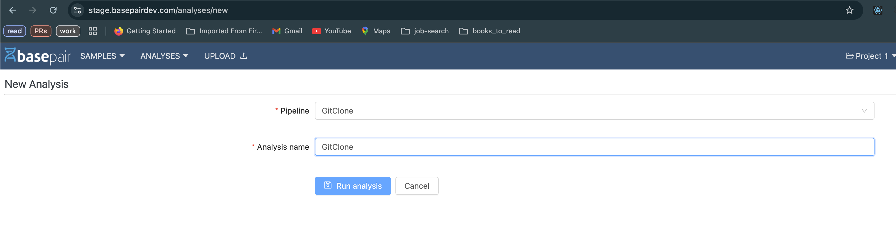

# Custom Modules

The **Module** feature allows users to create, manage, and reuse modules that can be integrated into pipelines. These modules define reusable commands, inputs, and outputs for various analysis tasks.

---

## 1. Navigate to Module List Page

- From the header, click on **Modules**.
- This opens the **Module List Page**.



### Features on the Listing Page

- **Filters & Pagination:** Search and filter modules, and navigate using pagination at the bottom.
- **+ New Button:** Located at the top-right, used to create a new custom module.
- **Module Name Links:** Clicking on a module name opens its **Detail Page**.

---


## 2. Module Detail Page

When you click a module name from the list:

- The **Module Detail Page** opens.
- It shows **Description, Command, Inputs, and Outputs**.
- At the top-right corner, you will see:
  - **Edit** → Update an existing module.
  - **Download as YAML** → Export the module definition as a YAML file.



---

## 3. Creating a New Module

To create a new module:

1. Click on **+ New** from the Module List Page.
2. Fill in the required details:
   - **Name** (mandatory)
   - **Description**
   - **Type, Visibility, Version**
   - **Command** (the actual script/command the module will execute)
3. Define **Inputs** details:




| Field      | Description                                                                                                                                             | Example Values                                                                                           |
|------------|---------------------------------------------------------------------------------------------------------------------------------------------------------|-----------------------------------------------------------------------------------------------------------|
| **label**  | Human-readable name displayed in the UI to identify the input. Should clearly describe what the user is expected to provide.                           | Genome, Spike-in, FASTQ R1, Sample Sheet, Reference File                                                  |
| **name**   | Internal name/key used by the workflow or pipeline to reference this input. This should match what the backend expects.                                | `genomeDir`, `spike_in_index`, `input_fastq`, `annotation_gtf`                                           |
| **optional** | Defines if the input is optional (`true`) or required (`false`). The UI may enforce this.                                                             | `false`, `true`                                                                                           |
| **show**   | Controls whether the field is visible in the UI. You can hide advanced/internal parameters.                                                             | `true`, `false`                                                                                           |
| **val**    | Default or pre-filled value. Can be empty, a default string, or a variable placeholder.                                                                 | `''`, `/data/genome/GRCh38/`, `true`, `default.txt`                                                       |
| **copy**   | Defines how the input data should be handled. Used during job execution to determine if the input should be copied.                                     | `dir`, `file`, `none`                                                                                     |
| **entity** | Used to link this input to a higher-level entity or data model (e.g., project, run, or dataset). Helps auto-populate fields from context.               | `sample`, `project`, `experiment`, `genome`                                                               |
| **field**  | Specifies which field or property of the entity to use. Often relevant when pulling metadata or linked values.                                          | `path`, `id`, `name`, `reference`, `index_file`                                                           |
| **file_type** | Specifies the expected file subtype, format, or category. Important for file validation or filtering.                                                | `fasta`, `star_index`, `bam`, `vcf`, `gtf`, `csv`                                                         |
| **help**   | Tooltip or help text shown near the field to guide users. Useful for clarifying format or purpose.                                                      | Select the STAR genome index directory., Optional spike-in genome.                                        |
| **type**   | Defines the kind of input component. Determines how the UI behaves and validates the field.                                                             | `string`, `boolean`, `integer`, `file`, `genome_file`, `directory`, `select`, `list`                      |


4. Define **Outputs**



| Field       | Description                                                                                                                                                 | Example Values                                                                                                   |
|-------------|-------------------------------------------------------------------------------------------------------------------------------------------------------------|-------------------------------------------------------------------------------------------------------------------|
| **action**  | Defines how the output file path is generated. Usually **"template"**, which means it uses a template expression (formula).                               | `template`, `copy`, `move`, `rename`                                                                              |
| **name**    | Internal identifier for the output file. Must be unique within the module.                                                                                  | `bam`, `bai`, `junctions`, `final_log`, `alignment_summary_json`                                                  |
| **save**    | Indicates if the output should be stored permanently (e.g., for viewing or downloading).                                                                    | `true`, `false`                                                                                                   |
| **show**    | Determines whether the output is visible in the UI or hidden (for intermediate or log files).                                                               | `true`, `false`                                                                                                   |
| **type**    | Specifies the kind of file or output produced. Used for categorization or UI rendering.                                                                     | `file`, `directory`, `json`, `image`, `text`, `plot`, `table`                                                     |
| **val**     | The filename or value produced by the process. Can be static or dynamically defined using Jinja templates.                                                  | `'Aligned.out.bam'`, `'Log.final.out'`, `'alignment-summary.json'`                                                |
| **formula** | Template path for where the output file will be located or generated. Usually includes placeholders like `{{basedir}}`, `{{slug}}`, `{{genome_name}}`.      | `_{{basedir}}/{{slug}}.{{genome_name}}.bam`                                                                       |
| **requires**| Conditional dependency — specifies that this output is only generated if certain input variables exist.                                                     | `[spike_in_name]`, `[genome_name]`                                                                                |
| **tags**    | Labels used to categorize outputs for later referencing or filtering (e.g., grouping all logs).                                                             | `[bam]`, `[bai]`, `[star_log, progress]`, `[alignment_summary, json]`                                             |
| **when**    | Conditional logic that determines whether this output should be created. Uses Jinja2 templating.                                                            | ` True  False `                                                     |

**5. Click Save.**



---

## 4. Editing a Module

- From the **Module Detail Page**, click **Edit**.
- Update any required fields (**Name**, **Command**, **Inputs**, **Outputs**, etc.).
- Click **Save** to apply changes.


---

## 5. Downloading a Module (YAML)

- On the **Module Detail Page**, click **Download as YAML**.
- This will export the module configuration into a **.yaml** file for reuse or sharing.

---

## 6. Using Modules in Pipelines

- **Modules** can be used inside **Pipelines**.
- When designing a pipeline, you can drag and drop or select these modules as nodes in **Custom Pipeline** as well.

---

## 7. Module Permissions & Visibility Rules

### 1) Roles Overview

There are three main roles:

| Role                       | Description                                                                                               |
|---------------------------|-----------------------------------------------------------------------------------------------------------|
| **Superuser (Basepair staff)** | Full access to all modules, settings, and administrative actions.                                        |
| **Host Admin / Manager**  | Can manage and view their own modules and public modules. Limited update/delete permissions.              |
| **Member (Regular User)** | Can access their own private modules and any public modules.                                              |

### 2) Visibility Types

Modules can have two visibility settings:

- **Private:** Accessible only to the module owner (and Superusers). Host Admin/Managers can view only if they are the owners.
- **Public:** Visible to all users in the system. Only Superusers can create or update public modules.

### 3) Module Permissions

| Action                       | Host Admin / Manager     | Member                  | Notes                                                                 |
|-----------------------------|--------------------------|-------------------------|-----------------------------------------------------------------------|
| **List modules**            | ✅ Own + Public          | ✅ Own + Public         | Public modules visible to all                                         |
| **View module detail**      | ✅ Own + Public          | ✅ Own + Public         | Access limited to owned/private modules or public ones.               |
| **Create Private module**   | ✅                       | ✅                      | All authenticated users can create private modules                    |
| **Create Public module**    | ❌                       | ❌                      | Non-superusers get 403: “Only superusers can create public modules.”  |
| **Update own private module** | ✅                     | ✅                      | Owners can edit their own private modules                             |
| **Update others private module** | ❌                  | ❌                      | Only Superuser can edit private modules they don’t own                |
| **Update public module**    | ❌                       | ❌                      | Only Superuser can edit public modules                                |
| **Delete own private module** | ✅                     | ✅                      | Owners can delete their private modules                               |
| **Delete public module**    | ❌                       | ❌                      | Product policy may restrict deletion. Only super user can do if permitted |


# Github Integration: Running an analysis:

### Step 0: Follow the steps for Github Integration

Steps can be found here : https://docs.basepairtech.com/integrations/github

### Step 1: Modify your custom module

Before you start using your private repository, you must clone it. Being a private repository, it cannot be cloned like a public repo (shown below):

```bash
# clone public repo
$ git clone <url-of-public-repo>
```

To clone private repo: 

```bash
$ python3.8 /home/ec2-user/bioinfo/infra/repository/github_integration.py --url https://github.com/test-org-amiay/test-repo --clonedir {{basedir}}/test-repo --branch main
```

`--url` : URL of the github Repository

`--clonedir` : location on the machine where you want to copy the repo; typically `{{basepair}}/<name_of_your_repo>`

`--branch` : Branch that you want to clone


This step can be done on the create page (or edit) of the module, as shown below in the image.


To go to the create a new module, visit https://\<basepair-url\>/modules/new

To edit an already existing module: visit https:///\<basepair-url\>/modules/ and the search for your module using the search feature as shown below
 



### Step 2: Add `basedir` mapping

The module that you created would be a part of a pipeline. Navigate to the edit section of the pipeline.


In the `Map platform params` section (right side of the above image), add the mapping as shown

`basedir` : `compute_basedir` 

### Step 3: Run an Analysis using the new Pipeline


