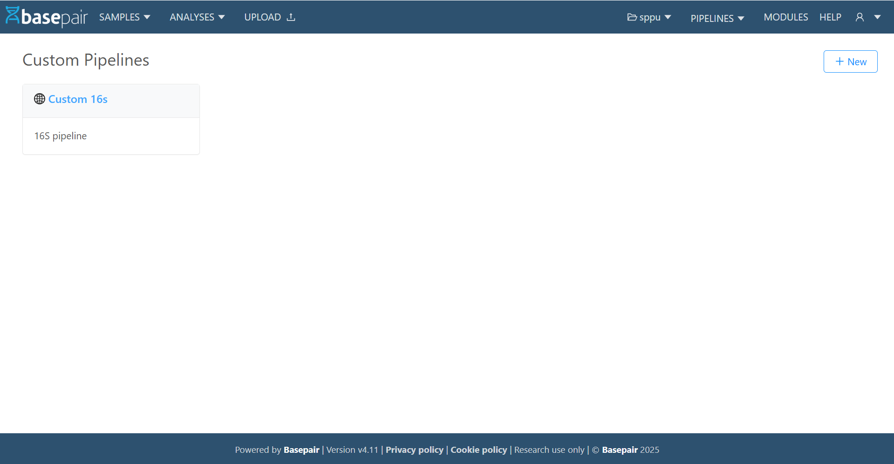
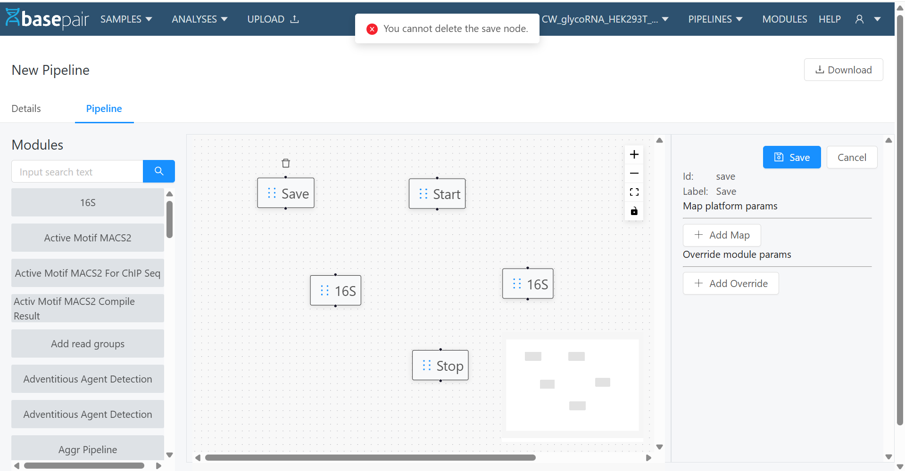
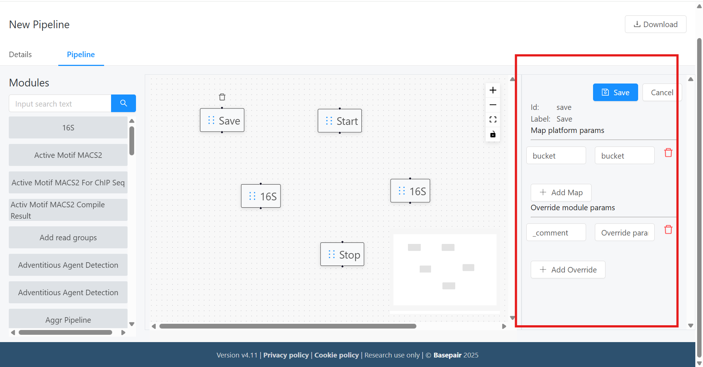
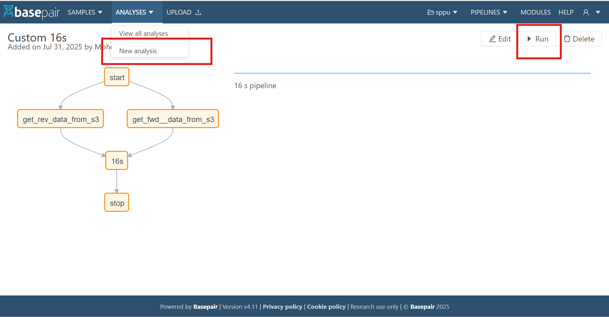
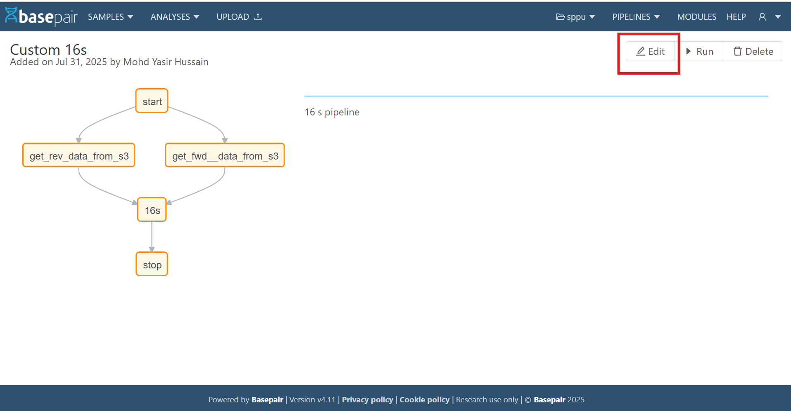

# Custom Pipeline 

## 1. Introduction
This document provides instructions on how to create, configure, and manage a custom pipeline in the application.

It covers:
- **Accessing the Custom Pipeline** page
- **Creating** a new pipeline
- **Adding modules**
- **Configuring** inputs/outputs
- **Saving and running** the pipeline

---

## 2. Navigation
1. Login to the application.  
2. Go to **Pipelines → Custom Pipeline**.  
3. You will see two main tabs:  
   - **Pipeline Details** – Configure name, datatype, description, etc.  
   - **Graph Form** – Design the pipeline visually.

---

## 3. Custom Pipeline – List Page
Once you navigate to the **Custom Pipeline** section, you will arrive at the **Custom Pipeline List Page**.  
This page displays all the pipelines you have access to, along with key details and available actions.

**Page Overview**  
The list page is typically divided into:

1. **Header Toolbar** – Contains buttons for actions such as:  
   - **Create New Pipeline** – Opens the pipeline creation form.

2. **Pipelines List** – Displays existing pipelines in a grid format with details such as:  
   - **Pipeline Name** – The name given to the custom pipeline. *(Clicking on Name opens the Pipeline Detail page.)*  
   - **Description** – The description of the custom pipeline.  
   - **Summary** – If description is not available, show summary.

3. **Pagination Controls** – If there are multiple pipelines, navigation buttons will appear at the bottom.

---

## 4. Creating a Pipeline

### Step 1 – Pipeline Details
When creating a new custom pipeline, you must first provide its basic details.

1. **Name**  
   - Enter a **unique pipeline name**.  
   - Avoid duplicate names to ensure clarity.
2. **Summary**  
   - Provide a **short summary** of the pipeline’s purpose.
3. **Description**  
   - Enter a **detailed description** of the pipeline.  
   - This helps users understand the workflow and use cases.
4. **Datatype**  
   - Select from the available data types.
5. **Visibility**  
   - Choose one of the following:  
     - **Public** → Visible to all users.  
     - **Private** → Only accessible to you and authorized collaborators.
6. **Infra**  
   - Select the infrastructure (instance type) on which the pipeline will run.
7. **Tags**  
   - Add relevant keywords to categorize.
8. **Validation**  
   - Add validation to the pipeline:  
     - **Required Fields:** items required for the pipeline once you check the checkbox.  
     - **Optional Fields:** items are optional if you do **not** check the checkbox.

---

## 4. Designing the Pipeline Graph

### Step 2 – Adding Modules
- By default, a non‑deletable **Start**, **Stop**, and **Save** module is placed.  
- Drag **Modules** to insert a drop space.  
- Search and select a module from the library.  
- Modules can be **duplicated**, and each instance can have **independent settings**.

### Step 3 – Configuring Module Parameters

**Open the Graph Form Panel**
- Click on a **module** in the pipeline graph.  
- The **Graph Form** panel will appear (a form view on the right side of the screen).

**Map Platform Parameters**  
- Under **Map Platform Params**, configure the **Node (module) info**.  
- These settings define how the module integrates with platform‑level parameters.

**Override Module Parameters**  
- Under **Override Module Params**, configure **Node (module) params** specific to that module.  
- These settings allow you to **modify default module behavior**.

### Step 4 – Connecting Module Parameters
Once modules are added to the pipeline canvas, you can define the data flow between them using the **drag‑and‑drop** interface.

**4.1 Drawing Edges Between Modules**
- Click on the **output** port of a source module and drag the connection line to the **input** port of a target module.  
- This creates an **edge** representing the data flow between the two modules.

**4.2 Configuring Child Node Connections**  
In the **bottom‑right** section of the interface, you’ll find the **Child Node** configuration panel.  
- **Inputs** – Displays available input fields for the next (child) module.  
- **Outputs** – Provides a dropdown list of output fields from the selected (parent) module.

Each connection is represented as a **tail_head** mapping:  
- **Tail** → The **output** from the parent module.  
- **Head** → The **input** of the child module.

**Example:**  
If *Module A* produces **output** as an output, and *Module B* expects **cls**, you would:
1. Select **cls** in the **Inputs** list.  
2. Choose **output** from the **Outputs** dropdown.  
3. **Save** the mapping to finalize the edge connection.

---

## 6. Saving the Pipeline
- As of now, there are **separate Save buttons** for each tab (**Details** and **Pipeline**).  
- Once saved, the pipeline appears in your **Pipeline List**.

---

## 7. Download the Pipeline as YAML File
Once your custom pipeline configuration is complete, you can export it as a **YAML** file for backup, sharing, or deployment.

1. **Locate the Download Button**  
   - At the **top‑right** corner of the Custom Pipeline editor, find the **Download** icon/button.
2. **Click “Download”**  
   - The system will generate a **YAML** representation of your pipeline.  
   - The YAML file includes all **nodes, edges, parameters, and metadata** of the current pipeline configuration.

---

## 8. Running the Custom Pipeline
Once your custom pipeline is created and saved, you can execute it directly from the pipeline list.

1. **Open the Pipeline Detail Page**  
   - Navigate to the **Pipeline List**.  
   - Select your custom pipeline.  
   - This opens the **Pipeline Detail** page.
2. **Choose a Run Method** (two options):  
   - From the **New Analyses** dropdown — located near the top‑left of the detail page.  
   - From the **Run** button — located at the **top‑right** corner of the page.
3. **Start a New Analysis**  
   - On the **New Analyses** page, select your custom pipeline from the dropdown.  
   - Click **Run**.
4. **Provide Runtime Parameters (if required)**  
   - Some pipelines require additional parameters (e.g., **sample file**, **analysis file**).  
   - Fill these in as prompted.
5. **Monitor the Execution**  
   - After launching, you will be redirected to a **results** page.  
   - The analysis appears in the **running analyses** table where you can track progress.

---

## 9. Editing an Existing Pipeline
Once your custom pipeline is created and saved, you can edit it directly from the pipeline list.

1. **Open the Pipeline Detail Page**  
   - Navigate to the **Pipeline List**.  
   - Select your custom pipeline.  
   - This opens the **Pipeline Detail** page.
2. **Click on _Edit_** — located at the **top‑right** corner of the page.  
3. Make changes in **Pipeline Details** or **Graph Form**.  
4. **Save** again to update.

---

## 10. Delete an Existing Pipeline
If you no longer need a custom pipeline, you can delete it from the system in just a few clicks.

1. **Open the Pipeline Detail Page**  
   - Go to the **Pipeline List**.  
   - Select the custom pipeline you want to remove.  
   - This opens the **Pipeline Detail** page.

2. **Click the Delete Button**  
   - The **Delete** button is located at the **top‑right** corner of the page.

3. **Confirm Deletion**  
   - Clicking **Delete** opens a confirmation modal.  
   - Read the warning carefully — once deleted, the pipeline **cannot be recovered**.  
   - Click **Delete** in the modal to permanently remove the pipeline.

<!-- # Custom pipeline

### Introduction

This document provides instructions on how to create, configure, and manage a custom pipeline in the application.
It covers:

- Accessing the Custom Pipeline page
- Creating a new pipeline
- Adding modules
- Configuring inputs/outputs
- Saving and running the pipeline

### Navigation

- Login to the application.
- Go to Pipelines → Custom Pipeline.
- You will see two main tabs:
    - Pipeline Details – Configure name, datatype, description, etc.
    - Graph Form – Design the pipeline visually.

    

### Custom pipeline - list page
Once you navigate to the Custom Pipeline section, you will arrive at the Custom Pipeline List Page.
This page displays all the pipelines you have access to, along with key details and available actions.

#### Page overview

The list page is typically divided into:

- **Header Toolbar** – Contains buttons for actions such as:
    - **Create New Pipeline** – Opens the pipeline creation form.

- **Pipelines List** – Displays existing pipelines in a grid format with details such as:

    - **Pipeline Name** – The name given to the custom pipeline. (Clicking on Name will open the pipeline detail page)
    - **Description** – The description of custom pipeline.
    - **Summary** – If description not available show summary.
- **Pagination Controls** – If there are multiple pipelines, navigation buttons will appear at the bottom.

    

### Creating a pipeline

**Step 1 - Pipeline Details**

    When creating a new custom pipeline, you must first provide its basic details.

- **Name**
    - Enter a unique pipeline name.
    - Avoid duplicate names to ensure clarity.

- **Summary**
    - Provide a short summary of the pipeline’s purpose.

- **Description**
    - Enter a detailed description of the pipeline.
    - This helps users understand the workflow and use cases.

- **Datatype**
    - Select from the available data types.

- **Visibility**
    - Choose one of the following:
        - Public → Visible to all users.
        - Private → Only accessible to you and authorized collaborators.

- **Infra**
    - Select the infrastructure (instance type) on which the pipeline will run.

- **Tags**
    - Add relevant keywords to categorize
- **Validation**
    - Add a validation to pipeline:
        - **Required Fields**: the things will be required for the pipeline once you check the checkbox.
        - **Optional Fields**: the things will be optional for the pipeline if you not check the checkbox.

    

### Designing the pipeline graph

#### Step 2 - Adding Modules
- By default, a non-deletable Start, Stop and Save module is placed.
- Drag Modules to insert a drop space.
- Search and select a module from the library.
- Modules can be duplicated, and each instance can have independent settings.

    

#### Step 3 - Configuring Module Parameters

**Open the graph form panel**
- Click on a module in the pipeline graph.
- The Graph Form panel will appear some form type view on the right side of the screen.

**Map Platform Parameters**
- Under Map Platform Params, configure the Node (module) info.
- These settings define how the module integrates with platform-level parameters.

**Override Module Parameters**
- Under Override Module Params, configure Node (module) params specific to that module.
- These settings allow you to modify default module behavior.

    

#### Step 4 – Connecting Module Parameters
Once modules are added to the pipeline canvas, you can define the data flow between them using the **drag-and-drop interface**.
- **4.1 Drawing Edges Between Modules**
    - Click on the output port of a source module and drag the connection line to the input port of a target module.
    - This creates an edge representing the data flow between the two modules.

- **4.2 Configuring Child Node Connections**
    In the **bottom-right section** of the interface, you’ll find the **Child Node** configuration panel.
    - Inputs – Displays available input fields for the next (child) module.
    - Outputs – Provides a dropdown list of output fields from the selected (parent) module.

    Each connection is represented as a tail_head mapping:
    - Tail → The output from the parent module.
    - Head → The input of the child module.

**Example**:
If *Module* A produces *output* as an output, and *Module B* expects *cls*, you would:
- Select *cls* in the **Inputs** list.
- Choose *output* from the **Outputs** dropdown.
- Save the mapping to finalize the edge connection.

    

### Saving the Pipeline
- As of now, we have separate save buttons for each Tab (Details and Pipeline).
- Once saved, the pipeline appears in your Pipeline List.

### Download the Pipeline as YAML File
Once your custom pipeline configuration is complete, you can export it as a YAML file for backup, sharing, or deployment.
- **Locate the Download Button**
    - At the top-right corner of the **Custom Pipeline** editor, find the **Download** icon/button.

- **Click “Download”**
    - The system will generate a YAML representation of your pipeline.
    - The YAML file includes all **nodes, edges, parameters, and metadata** of the current pipeline configuration.

    

### Running the Custom Pipeline
Once your custom pipeline is created and saved, you can execute it directly from the pipeline list.
- Open the Pipeline Detail Page
    - Navigate to the Pipeline List.
    - Select your custom pipeline.
    - This will open the Pipeline Detail page.

- Choose a Run Method
You can start the pipeline in two ways:
    - From the “New Analyses” Dropdown
        - Located in the top-left area (highlighted in a red rectangle in the guide screenshot).
    - From the Run Button
        - Located at the top-right corner of the page.

- Start a New Analysis
    - Once you are on the New Analyses page, select your custom pipeline from the dropdown.
    - Click Run.

- Provide Runtime Parameters (if required)
    - Some pipelines require you to specify additional parameters (e.g., sample file, analysis file).
    - Fill these in as prompted.

- Monitor the Execution
    - After launching, you will be redirected to a results page.
    - The analysis will appear in the running analyses table, where you can track its progress.

    

### Editing an Existing Pipeline
Once your custom pipeline is created and saved, you can edit it directly from the pipeline list.
- Open the Pipeline Detail Page
    - Navigate to the Pipeline List.
    - Select your custom pipeline.
    - This will open the Pipeline Detail page.

- Click on Edit Button:
    - Located at the top-right corner of the page.

- Make changes in Pipeline Details or Graph Form.

- Save again to update.

    

### Delete an Existing Pipeline
If you no longer need a custom pipeline, you can delete it from the system in just a few clicks.
- Open the Pipeline Detail Page
    - Go to the Pipeline List.
    - Select the custom pipeline you want to remove.
    - This will open the Pipeline Detail page.

- Click the Delete Button
    - The Delete button is located at the top-right corner of the page.

- Confirm Deletion
    - Clicking Delete will open a confirmation modal.
    - Read the warning carefully—once deleted, the pipeline cannot be recovered.
    - Click Delete in the modal to permanently remove the pipeline.

     -->